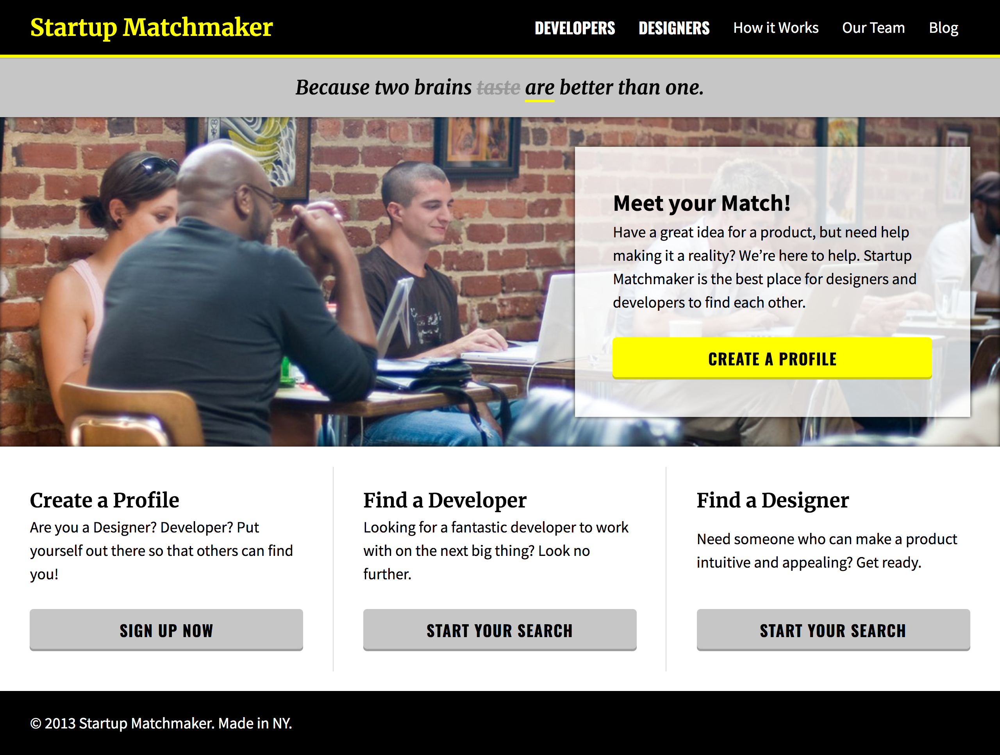

[](https://generalassemb.ly/education/web-development-immersive)

# Flexbox HW

You have been hired by a new startup named **Startup Matchmaker**.  It is a network for developers, designers, and entrepreneurs so that they can connect and start businesses.  

Your client needs you to build them a landing page so that they can start marketing their product!  They've given you an image of the site and some design specifications.  



## Design Specifications

```
Main Font
- font-family: 'Source Sans Pro', sans-serif;
- font-size: 20px;
- line-height: 1.5;

"Startup Matchmaker", "Because two brains are better than one", and  "Create a Profile" Font
- font-family: 'Merriweather', serif;

"Find Developers" and "Find Designers" Font
- font-family: 'Oswald', sans-serif;

Colors
- white
- yellow
- black
- dark grey #999
- light grey #C6C6C6

Buttons Font
- font-family: 'Oswald', sans-serif;

Content
- Because two brains taste are better than one.

- Have a great idea for a product, but need help making it a reality? We’re here to help. Startup Matchmaker is the best place for designers and developers to find each other.

- Are you a Designer? Developer? Put yourself out there so that others can find you!

- Looking for a fantastic developer to work with on the next big thing? Look no further.

- Need someone who can make a product intuitive and appealing? Get ready.

- © 2013 Startup Matchmaker. Made in NY.
```